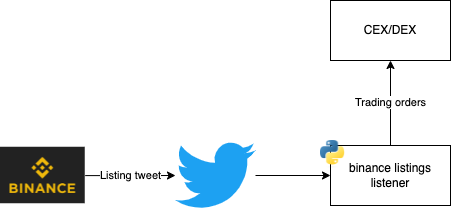

### A Binance new coin listing listener 

This repo is a simple implementation of a listener to cryptocurrency exchange listings on Twitter. 
It's implemented for Binance but can be easily extended to other exchanges.

#### Features:
- Robust and scalable websocket/stream based listener, ensuring no missed announcements
- Extendable to other exchanges
- Easily plugin handlers for triggering orders or other actions upon listing detection
- Easily modify coin listing detection logic for any exchange

#### How to detect a listing

Exchanges tend to have standardized listing announcements on Twitter. Check recent announcements on the exchange's
twitter feed, and create a handler function with basic string logic to detect whether a tweet is a listing announcement.

#### Configs

The script requires Twitter developer access and tokens. 
Telegram configs are included, but not required, for sending telegram alerts

#### Running the script

Any recent Python+tweepy version would work. The only customization potentially needed is on the business 
logic for detecting coin listings.


```bash
python run_listing_listener.py -config auth_config.json"
```



